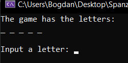
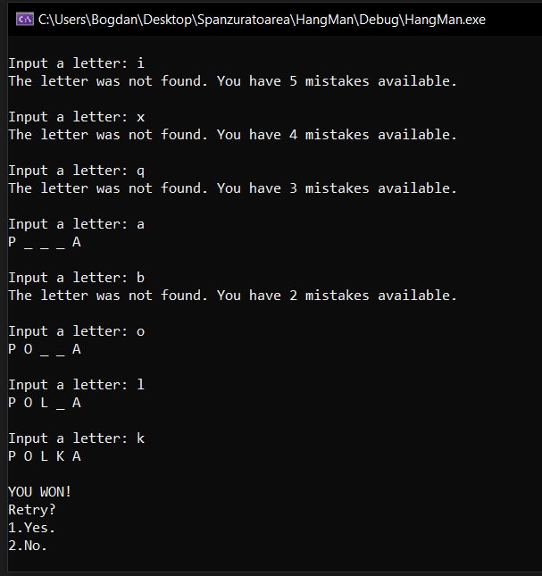
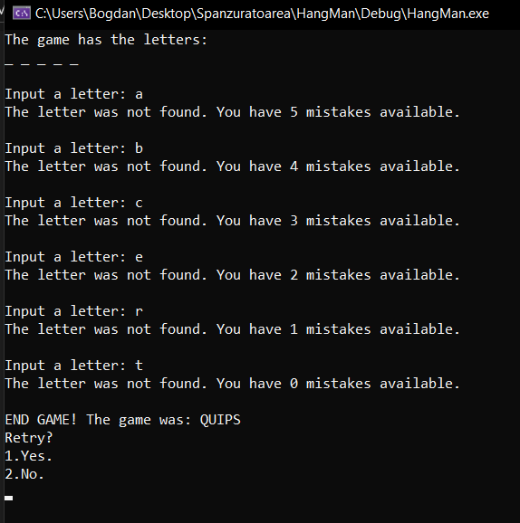

# HangMan

A project made in C++

This project is made in order to learn 'regex', but also to do something fun like a game.

The entire game is structured in English, and the words can be modified from the 'HangMan.txt' file.

This is how it looks when you win.

This is how it looks when you lose.

